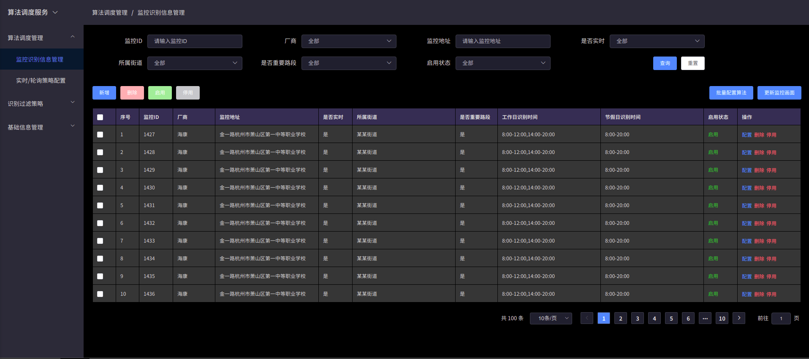

# 项目架构说明

## 技术架构

`Vue 3 + TSX + Typescript + Vite + Element-plus`

## 参考文档

1. <a href="https://www.tslang.cn/docs/handbook/basic-types.html" target="_blank">TypeScript 官方中文文档</a>
2. <a href="https://v3.cn.vuejs.org/guide/introduction.html" target="_blank">Vue 3 官方中文文档</a>
3. <a href="https://cn.vitejs.dev/" target="_blank">Vite 官方中文文档</a>
4. <a href="https://github.com/vuejs/jsx-next/blob/dev/packages/babel-plugin-jsx/README-zh_CN.md" target="_blank">Vue 3 Babel JSX 插件</a>
5. <a href="https://element-plus.gitee.io/#/zh-CN/component/installation" target="_blank">Element-plus 官方中文文档</a>
6. <a href="https://lbs.amap.com/api/jsapi-v2/guide/abc/prepare" target="_blank">准备-入门-教程-地图 JS API v2.0 | 高德地图API</a>
7. <a href="https://lbs.amap.com/api/jsapi-v2/documentation" target="_blank">参考手册-地图 JS API v2.0 | 高德地图API</a>

## 目录结构

```bash

├── config                        // vite配置文件
│   ├── alias.ts                 // 别名配置
│   ├── css.modules.ts           // 配置 CSS modules 的行为
│   ├── css.preprocessor.ts      // 指定传递给 CSS 预处理器的选项
│   ├── env.ts                   // 开发或生产环境变量设置
│   ├── imp.ts                   // vite-plugin-imp配置
│   ├── index.ts                 // 配置主入口
│   └── proxy.ts                 // 代理配置
├── index.html                    
├── package.json
├── public
│   └── favicon.ico
├── README.md
├── src
│   ├── apis                     // API的统一配置
│   ├── app.d.ts                 // 类型的定义
│   ├── App.tsx
│   ├── assets
│   │   └── logo.png
│   ├── components               // 公用的组件封装
│   │   ├── action-btns
│   │   ├── action-icons
│   │   ├── a-map
│   │   ├── card-tabs
│   │   ├── config-form
│   │   ├── dialog
│   │   ├── layout
│   │   ├── pagination
│   │   ├── search-form
│   │   ├── table-view
│   │   ├── tree-transfer
│   │   └── tree-view
│   ├── main.ts
│   ├── plugins                  // 插件的配置
│   │   ├── element.ts
│   │   └── index.ts
│   ├── router                   // 路由配置
│   │   ├── modules             // 各模块的路由配置
│   │   ├── config.ts           // 相关配置
│   │   ├── headless.ts         // 无头路由
│   │   ├── index.ts            // 路由入口
│   │   └── routes.ts           // 路由配置
│   ├── services                 // 复用的业务
│   │   ├── useCheck.ts
│   │   ├── useCRUD.ts
│   │   ├── useDialogVisible.ts
│   │   ├── useEditRow.ts
│   │   ├── useFormData.ts
│   │   ├── useForm.ts
│   │   ├── useStartOrStop.ts
│   │   └── useTable.ts
│   ├── store                     // 状态管理，暂未使用
│   │   └── index.ts
│   ├── style                     // 主题样式配置
│   │   ├── element-themes       // element变量覆盖，定制主题色
│   │   ├── index.scss           // 主要样式
│   │   ├── themes               // 主题配置
│   │   └── variable.scss        // scss变量
│   ├── utils                     // 工具库
│   │   ├── constant.ts          // 常量
│   │   ├── index.ts             // 工具函数
│   │   └── req.ts               // axios封装
│   └── views                     // 页面
├── stats.html                     // 代码分析页面，由rollup-plugin-visualizer插件生成
├── tsconfig.json                  // ts配置
├── vite.config.ts                 // vite配置
└── yarn.lock

```

## 项目运行

### 安装

``` bash

yarn

```

### 开发模式

```bash

yarn dev

```

### 编译打包

```bash

yarn build

```

### 启动

```bash

yarn serve

```

## 项目特色

### 框架切换

为了方便嵌入其他应用的需求，提供某种访问路由，显示没有头部和菜单导航的页面，这里姑且称这种路由为无头路由，对应的页面为无头页面。通过环境变量去控制是否需要这种功能，主要配置在 .env 文件里。

VITE_APP_HEADLESS_PREFIX 是无头路由的前缀，VITE_APP_HEADLESS_OPEN 配置 0 或者 1 来开关这个功能。

目前系统的 .env 文件配置如下：

```bash

VITE_APP_HEADLESS_PREFIX=headless
VITE_APP_HEADLESS_OPEN=1

```

当开启了无头路由，那么可通过访问路由以 /headless 开头，出现的页面就是没有头部和菜单导航的。比如访问<a href="http://127.0.0.1:3000/home/schedule/monitor">http://127.0.0.1:3000/home/schedule/monitor</a> 页面，对应的无头路由页面就是 <a href="http://127.0.0.1:3000/headless/schedule/monitor">http://127.0.0.1:3000/headless/schedule/monitor</a> 。

原始页面如下图所示：


无头页面如下图所示：


### 主题切换

为了应对后期会有切换主题风格的需求，做了这方面方案的探索。首先可以通过<a href="https://element-plus.gitee.io/#/zh-CN/component/custom-theme" target="_blank">定制Element-Plus主题风格</a>的方式，这也是推荐的方式。但有时候设计原型只是简单的几种组件，而且改变的主题色和样式有限，通过覆盖和重写原有Element-Plus样式的方式也可以满足需求了，但不推荐这种方式。具体采用何种方式视实际需求可做调整。

目前项目中提供了三种主题色分别是浅色 ( light )、深色 ( dark )和原色 ( primary )，主要文件是style/themes里面，默认采用的主题是 light。

> 注意：具体的没用到组件的样式有些可能需要微调，特别是 dark 主题的，light 和 primary 主题的样式则基本和组件库原有的风格一致。

dark 主题如下图所示：



light 主题如下图所示：


primary 主题如下图所示：


